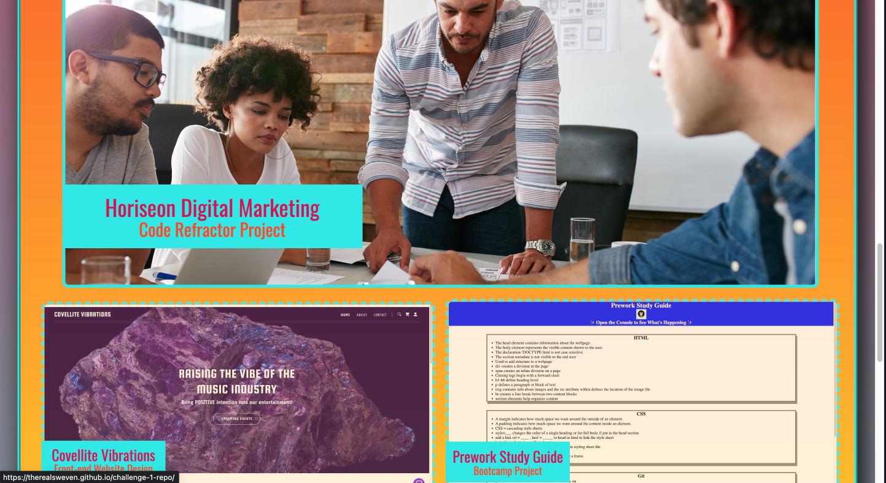

# Potential Employee Portfolio

## Description

Say an employer is requesting a portfolio of work samples from a potential employee so that they can review the work experience of the candidate. This site is meant to be the beginning of what I will use to eventually send samples of my personal work to a potential employer. This site puts personal info about me as well as screenshots of samples that include links to the actual web apps I have built.

URL: https://therealsweven.github.io/robert-simpson-portfolio/

## Installation

N/A

## Usage

This web app contains a single html page with a navbar linked to corresponding sections within the page. Clicking a navbar option will automatically scroll the site to the location of the corresponding section. The about section contains a general background of me. The content section contains a flexbox containing images of different web apps I have built, each one being linked to the url for that app. Clicking on an image will direct you to the web app, opening it in a new tab. The contact section includes various methods of contact all linked to the proper places. Social media pages will open in a new tab, 'email' will open an email to my email address, and clicking the phone will be bring up an option to call, at least on mobile devices. The site is responsive and may be accessible on desktops, tablets, and mobile devices.

## Credits

Referenced W3 schools for info on hover overlays and hover transparency changes.. Pictures royalty free found on unsplash.

## License

N/A

## Badges

N/A

## Features

N/A

## How to Contribute

N/A

## Tests

N/A
